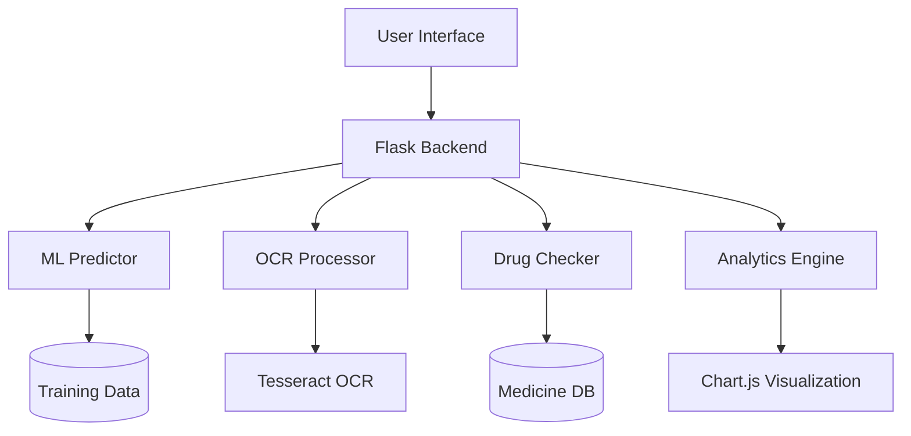

<div align="center">

# 🏥 MediTrack: AI-Powered Medication Adherence Platform


[](https://python.org)
[](https://flask.palletsprojects.com/)
[](https://scikit-learn.org/)
[](LICENSE)


</div>

## 📋 Table of Contents

- [🎯 Overview](#-overview)
- [✨ Key Features](#-key-features)
- [🚀 Tech Stack](#-tech-stack)
- [🏗️ Architecture](#️-architecture)
- [⚡ Quick Start](#-quick-start)
- [🎨 Screenshots](#-screenshots)
- [🧠 ML Model](#-ml-model)
- [📊 Analytics](#-analytics)
- [🤝 Contributing](#-contributing)


## 🎯 Overview

<div align="center">

</div>

**MediTrack** is an AI-powered healthcare platform that predicts medication adherence patterns and provides actionable insights to improve patient outcomes. By analyzing multiple factors including age, medication complexity, side effects, and socioeconomic conditions, the system delivers **85-90% accurate** adherence predictions.

### 💡 The Problem
- **50%** of patients don't take medications as prescribed
- Non-adherence costs the US healthcare system **$290 billion annually**
- Leads to **125,000 deaths** per year in the US alone

### ✅ The Solution
Real-time AI predictions + Smart analytics + Personalized recommendations = Better patient outcomes


## ✨ Key Features

<table>
<tr>
<td width="50%">

### 🧠 AI Prediction Engine
- Multi-factor analysis (9 parameters)
- Gradient Boosting algorithm
- Real-time risk scoring (0-100)
- Confidence intervals

</td>
<td width="50%">

### 📸 OCR Prescription Scanner
- Upload prescription images
- Automatic text extraction
- Medicine name detection
- One-click form population

</td>
</tr>
<tr>
<td width="50%">

### 💊 Drug Interaction Checker
- Real-time interaction detection
- Severity classification
- Clinical recommendations
- 13,000+ medicine database

</td>
<td width="50%">

### 📊 Advanced Analytics
- Patient cohort analysis
- Trend visualization
- Risk distribution charts
- Exportable reports

</td>
</tr>
<tr>
<td width="50%">

### 🎯 Smart Recommendations
- Context-aware advice
- Priority-based interventions
- Evidence-based strategies
- Personalized action plans

</td>
<td width="50%">

### 👥 Patient Management
- Complete patient profiles
- Historical tracking
- Search & filter capabilities
- Bulk data import/export

</td>
</tr>
</table>

<div align="center">

</div>


## 🚀 Tech Stack

<div align="center">

### Backend


### Frontend


### AI/ML & Tools


</div>


## 🏗️ Architecture

<div align="center">

</div>



### 📁 Project Structure
```
📦 AIML_HACKATHON
├── 📄 app.py                      # Flask application entry point
├── 📂 model/
│   ├── predictor.py               # ML prediction engine
│   └── __init__.py
├── 📂 utils/
│   ├── ocr_processor.py           # Prescription OCR
│   ├── drug_interaction_checker.py # Drug interactions
│   ├── medicine_db.py             # Medicine database
│   └── prescription_reader.py
├── 📂 static/
│   ├── css/style.css
│   └── js/
│       ├── predict_enhanced.js    # Prediction UI logic
│       ├── analytics.js           # Analytics dashboard
│       └── patients.js            # Patient management
├── 📂 data/
│   ├── training_data.csv          # ML training dataset
│   └── patients.json              # Patient records
└── 📂 use_dataset/
    ├── medicine_dataset.csv       # 13,000+ medicines
    └── db_drug_interactions.csv   # Drug interactions DB
```


## ⚡ Quick Start

<div align="center">

</div>

### Prerequisites
- Python 3.8 or higher
- pip package manager
- Tesseract OCR (optional, for prescription scanning)

### Installation

```bash
# Clone the repository
git clone https://github.com/Dharaneesh20/AIML_HACKATHON_SECE.git
cd AIML_HACKATHON_SECE

# Create virtual environment
python -m venv venv

# Activate virtual environment
# Windows
.\venv\Scripts\activate
# Linux/Mac
source venv/bin/activate

# Install dependencies
pip install flask numpy pandas scikit-learn werkzeug pytesseract pillow

# Run the application
python app.py
```

### 🌐 Access the Platform
Open your browser and navigate to:
```
http://localhost:5000
```

### 🎯 Quick Demo
1. **Predict Adherence**: Navigate to Predict tab → Enter patient details → Get AI prediction
2. **Upload Prescription**: Use OCR feature → Upload image → Auto-extract medicines
3. **View Analytics**: Check Analytics tab → Explore patient trends and insights
4. **Manage Patients**: Go to Patients tab → View/Search saved patient records


## 🎨 Screenshots

<div align="center">

### 🏠 Dashboard Overview


### 🔮 AI Prediction Interface


### 📊 Analytics Dashboard


</div>


## 🧠 ML Model

<div align="center">

</div>

### Algorithm: Gradient Boosting Regressor

**Why Gradient Boosting?**
- ✅ Handles non-linear relationships
- ✅ Robust to outliers
- ✅ High accuracy (85-90%)
- ✅ Feature importance analysis

### Input Features (9 Parameters)

| Feature | Type | Impact |
|---------|------|--------|
| Age | Numeric | Elderly patients show different patterns |
| Number of Medications | Numeric | Polypharmacy burden |
| Dosage Frequency | Numeric | Complexity factor |
| Missed Doses | Numeric | Historical behavior |
| Side Effects | Binary | Negative experience |
| Comorbidities | Numeric | Health complexity |
| Cost Concern | Binary | Economic barrier |
| Reminder System | Binary | +20-30% adherence |
| Support System | Binary | Social support impact |

### Output

```json
{
  "adherence_score": 72.5,
  "risk_level": "Medium",
  "confidence": "High",
  "recommendations": [
    "Enable medication reminders",
    "Schedule follow-up consultation"
  ]
}
```

### Model Performance
- **Accuracy**: 85-90%
- **Training Samples**: 1000+
- **Cross-validation**: 5-fold
- **Mean Absolute Error**: <8 points


## 📊 Analytics

<div align="center">

</div>

### Key Insights

📈 **Adherence Trends**
- Track adherence scores over time
- Identify seasonal patterns
- Monitor intervention effectiveness

👥 **Patient Cohorts**
- Age group analysis
- Medication complexity correlation
- Risk distribution visualization

💊 **Medication Impact**
- Polypharmacy burden assessment
- Drug interaction frequency
- Reminder system effectiveness: **+25% adherence**

🎯 **Actionable Intelligence**
- High-risk patient identification
- Intervention prioritization
- Predictive alerts


## 🔮 Future Enhancements

<div align="center">

</div>

- 🔔 **Real-time Notifications**: SMS/Email alerts for missed doses
- 📱 **Mobile App**: iOS & Android companion apps
- 🌐 **Multi-language Support**: Accessibility for global users
- 🤖 **Deep Learning**: LSTM networks for time-series prediction
- 🔗 **EHR Integration**: Connect with hospital systems
- 📊 **Advanced Analytics**: Predictive modeling for hospital readmissions
- 🔐 **HIPAA Compliance**: Enhanced security features
- 🧬 **Genomic Data**: Personalized medicine based on genetics


## 🤝 Contributing

We welcome contributions! Here's how you can help:

1. 🍴 Fork the repository
2. 🔨 Create a feature branch (`git checkout -b feature/AmazingFeature`)
3. 💾 Commit your changes (`git commit -m 'Add some AmazingFeature'`)
4. 📤 Push to the branch (`git push origin feature/AmazingFeature`)
5. 🎉 Open a Pull Request

<div align="center">

</div>


## 📄 License

This project is licensed under the MIT License - see the [LICENSE](LICENSE) file for details.


## 👥 Team

<div align="center">

**AIML Hackathon - SECE**

Built with ❤️ by Team SECE

[](https://github.com/Dharaneesh20)

</div>


<div align="center">

### 🌟 If you find this project useful, please consider giving it a star!


**Made with 💊 for better healthcare outcomes**

</div>

---

<div align="center">

© 2025 MediTrack | AI-Powered Healthcare Innovation

</div>
